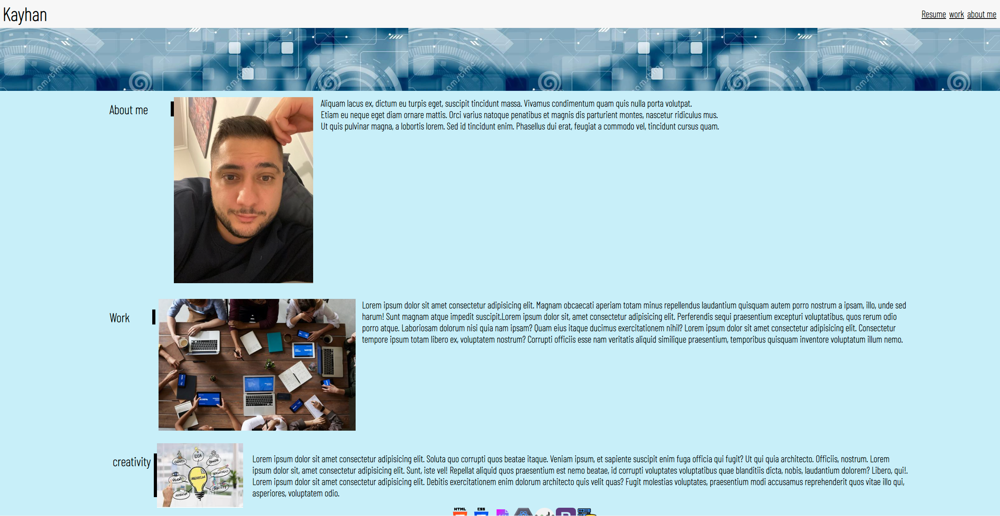

# Portfoliolia

## Description

objective of this work was to come up with a responsive website so users who own iphones, iphone SE, iphones XR, iphones 12 Pro and desktop. Making the design responsive has helped our website become more mobile friendly and increasing users screen time for our website.

## Built With

Html
CSS

## Installation

git clone git@github.com:byunn90/Portfoliolia.git

## Usage

To add a screenshot, create an `assets/images` folder in your repository and upload your screenshot to it. Then, using the relative filepath, add it to your README using the following syntax:

    ```md
    
    ```

---

## Contact me

kayhanturk90@Live.com

https://github.com/byunn90
